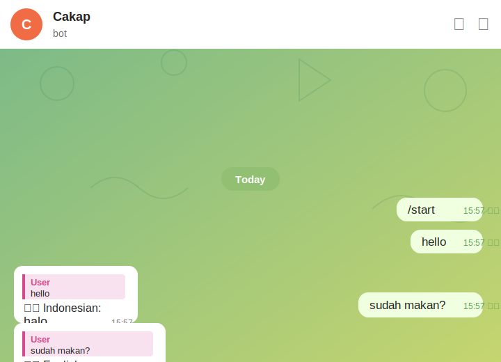
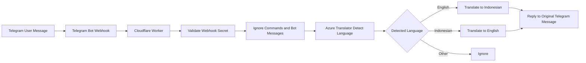

# Cakap

Cakap is a lightweight Telegram group translation bot for English and Indonesian conversations.

It was built as a practical low-code / small-code project using Telegram Bot API, Cloudflare Workers, and Azure AI Translator. The bot listens to Telegram messages, detects whether the message is in English or Indonesian, translates it into the other language, and replies to the original message.

## Start Here

New to Telegram bots, Cloudflare Workers, Azure Translator, or webhooks? Start with:

1. [`docs/00-start-here-for-beginners.md`](docs/00-start-here-for-beginners.md) — plain-English overview
2. [`docs/setup-guide.md`](docs/setup-guide.md) — step-by-step build guide
3. [`docs/architecture.md`](docs/architecture.md) — how the components fit together
4. [`docs/operations-guide.md`](docs/operations-guide.md) — how to troubleshoot and maintain it
5. [`docs/privacy-and-limitations.md`](docs/privacy-and-limitations.md) — privacy posture and known limitations
6. [`docs/future-features-and-constraints.md`](docs/future-features-and-constraints.md) — feature ideas and why they are deferred

## Current Working Behaviour

| Input | Bot Output |
|---|---|
| English message | Indonesian translation |
| Indonesian message | English translation |
| Telegram command, such as `/start` | Ignored |
| Non-text content | Ignored |
| Message above configured length threshold | Rejected with a short notice |

Example:

```text
User: hello
Bot: 🇮🇩 Indonesian:
halo

User: sudah makan?
Bot: 🇬🇧 English:
Have you eaten?
```

## Demo

The image below is a sanitized demo based on a working Telegram test. Personal identifiers have been replaced with generic labels.



## Why This Was Built

The project was created to reduce language friction in day-to-day Telegram group communication, especially where English and Indonesian speakers need to coordinate quickly.

The goal is not to create a complex chatbot. The goal is a simple, understandable, privacy-conscious translator that can run with minimal infrastructure.

## Why the Current Version Stops Here

The current version is intentionally kept as a minimum viable working bot.

Potential features such as menus, language-mode switching, group allowlists, usage dashboards, inline buttons, and multi-language support are documented but deferred. The main reason is to avoid unnecessary complexity and reduce the chance of consuming free-tier translation or Worker usage too quickly.

The concern is not that the Telegram bot token will be "used up". The concern is that a more public or more automated bot can process more messages, consume more translation characters, create more Worker requests, and require more operational oversight.

See [`docs/future-features-and-constraints.md`](docs/future-features-and-constraints.md) for the feature backlog.

## Technology Stack

| Layer | Technology | Purpose |
|---|---|---|
| Chat interface | Telegram bot | Receives and replies to group messages |
| Runtime | Cloudflare Workers | Hosts the webhook endpoint |
| Translation engine | Azure AI Translator | Detects language and translates text |
| Secrets | Cloudflare Worker variables and secrets | Stores API keys and bot token outside source code |
| Repository | GitHub | Documents the implementation and stores sanitized source code |

## High-Level Architecture



## Repository Structure

```text
Cakap/
├── README.md
├── assets/
│   └── cakap-demo-redacted.svg
├── src/
│   └── worker.js
├── docs/
│   ├── 00-start-here-for-beginners.md
│   ├── architecture.md
│   ├── setup-guide.md
│   ├── operations-guide.md
│   ├── privacy-and-limitations.md
│   ├── screenshot-redaction-guide.md
│   └── future-features-and-constraints.md
├── .env.example
├── .gitignore
└── LICENSE
```

## Required Secrets

The bot requires the following runtime variables in Cloudflare Workers:

| Name | Type | Purpose |
|---|---|---|
| `AZURE_TRANSLATOR_KEY` | Secret | Azure Translator API key |
| `AZURE_TRANSLATOR_REGION` | Text | Azure region, for example `southeastasia` |
| `TELEGRAM_BOT_TOKEN` | Secret | Telegram bot token from BotFather |
| `WEBHOOK_SECRET` | Secret | Shared secret used by Telegram webhook requests |

These values must never be committed into GitHub.

## Deployment Summary

1. Create a Telegram bot using BotFather.
2. Create an Azure AI Translator resource.
3. Create a Cloudflare Worker.
4. Add the required Cloudflare Worker secrets.
5. Deploy `src/worker.js` into the Worker.
6. Set the Telegram webhook to the Worker URL.
7. Disable Telegram bot privacy mode if the bot needs to read normal group messages.
8. Add the bot to the Telegram group.

See [`docs/setup-guide.md`](docs/setup-guide.md) for the full setup flow.

## Security and Privacy Principles

- Do not commit API keys, bot tokens, tenant IDs, or subscription details.
- Do not store Telegram message history in this implementation.
- Tell group members that an automatic translation bot is present.
- Avoid sending passwords, banking information, identity documents, medical details, or other sensitive personal information into the group.
- Use a webhook secret to reduce unauthorised POST requests to the Worker.

## Project Status

| Capability | Status |
|---|---|
| Telegram bot creation | Completed |
| Cloudflare Worker deployment | Completed |
| Azure Translator integration | Completed |
| English to Indonesian translation | Working |
| Indonesian to English translation | Working |
| Direct Telegram chat testing | Working |
| Telegram group deployment | Working |
| GitHub documentation | Completed |
| Sanitized demo asset | Completed |
| Beginner guide | Completed |
| Feature backlog and constraints note | Completed |

## Deferred Enhancements

The following features are useful but intentionally not implemented in the current version:

- `/help` command
- `/privacy` command
- `/add` group invite helper
- `/mode` command
- Language mode switching, such as English → Indonesian only
- Group allowlist
- Usage counter
- Usage dashboard
- Inline buttons
- Multi-language support beyond English and Indonesian

These are tracked in [`docs/future-features-and-constraints.md`](docs/future-features-and-constraints.md).

## Disclaimer

This repository contains sanitized implementation notes and source code for a personal learning project. It does not contain Telegram bot tokens, Azure keys, Cloudflare secrets, private chat logs, production credentials, or confidential organizational information.