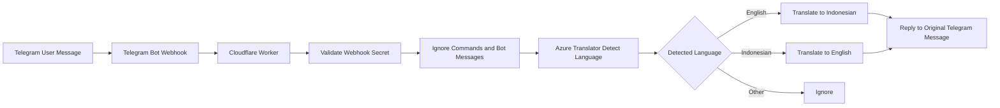

# Cakap

Cakap is a lightweight Telegram group translation bot for English and Indonesian conversations.

It was built as a practical low-code / small-code project using Telegram Bot API, Cloudflare Workers, and Azure AI Translator. The bot listens to Telegram messages, detects whether the message is in English or Indonesian, translates it into the other language, and replies to the original message.

## Current Working Behaviour

| Input | Bot Output |
|---|---|
| English message | Indonesian translation |
| Indonesian message | English translation |
| Telegram command, such as `/start` | Ignored |
| Non-text content | Ignored |
| Message above configured length threshold | Rejected with a short notice |

Example:

```text
User: hello
Bot: 🇮🇩 Indonesian:
halo

User: sudah makan?
Bot: 🇬🇧 English:
Have you eaten?
```

## Why This Was Built

The project was created to reduce language friction in day-to-day Telegram group communication, especially where English and Indonesian speakers need to coordinate quickly.

The goal is not to create a complex chatbot. The goal is a simple, understandable, privacy-conscious translator that can run with minimal infrastructure.

## Technology Stack

| Layer | Technology | Purpose |
|---|---|---|
| Chat interface | Telegram bot | Receives and replies to group messages |
| Runtime | Cloudflare Workers | Hosts the webhook endpoint |
| Translation engine | Azure AI Translator | Detects language and translates text |
| Secrets | Cloudflare Worker variables and secrets | Stores API keys and bot token outside source code |
| Repository | GitHub | Documents the implementation and stores sanitized source code |

## High-Level Architecture



## Repository Structure

```text
Cakap/
├── README.md
├── src/
│   └── worker.js
├── docs/
│   ├── architecture.md
│   ├── setup-guide.md
│   ├── operations-guide.md
│   ├── privacy-and-limitations.md
│   └── screenshot-redaction-guide.md
├── .env.example
├── .gitignore
└── LICENSE
```

## Required Secrets

The bot requires the following runtime variables in Cloudflare Workers:

| Name | Type | Purpose |
|---|---|---|
| `AZURE_TRANSLATOR_KEY` | Secret | Azure Translator API key |
| `AZURE_TRANSLATOR_REGION` | Text | Azure region, for example `southeastasia` |
| `TELEGRAM_BOT_TOKEN` | Secret | Telegram bot token from BotFather |
| `WEBHOOK_SECRET` | Secret | Shared secret used by Telegram webhook requests |

These values must never be committed into GitHub.

## Deployment Summary

1. Create a Telegram bot using BotFather.
2. Create an Azure AI Translator resource.
3. Create a Cloudflare Worker.
4. Add the required Cloudflare Worker secrets.
5. Deploy `src/worker.js` into the Worker.
6. Set the Telegram webhook to the Worker URL.
7. Disable Telegram bot privacy mode if the bot needs to read normal group messages.
8. Add the bot to the Telegram group.

See [`docs/setup-guide.md`](docs/setup-guide.md) for the full setup flow.

## Security and Privacy Principles

- Do not commit API keys, bot tokens, tenant IDs, or subscription details.
- Do not store Telegram message history in this implementation.
- Tell group members that an automatic translation bot is present.
- Avoid sending passwords, banking information, identity documents, medical details, or other sensitive personal information into the group.
- Use a webhook secret to reduce unauthorised POST requests to the Worker.

## Project Status

| Capability | Status |
|---|---|
| Telegram bot creation | Completed |
| Cloudflare Worker deployment | Completed |
| Azure Translator integration | Completed |
| English to Indonesian translation | Working |
| Indonesian to English translation | Working |
| Direct Telegram chat testing | Working |
| Telegram group deployment | Working / in progress depending on group privacy setting |
| GitHub documentation | In progress |

## Planned Enhancements

- Add group-only allowlist to prevent unintended use in unknown chats.
- Add simple usage counter without storing message text.
- Add configurable maximum message length.
- Add optional support for Malay if needed.
- Add deployment through GitHub-to-Cloudflare integration.
- Add sanitized screenshots after removing personal email, bot token, Azure key, subscription ID, tenant ID, and chat identifiers.

## Disclaimer

This repository contains sanitized implementation notes and source code for a personal learning project. It does not contain Telegram bot tokens, Azure keys, Cloudflare secrets, private chat logs, production credentials, or confidential organizational information.
