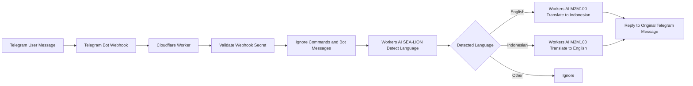

# Cakap

Cakap is a lightweight Telegram group translation bot for English and Indonesian conversations.

The original version was built using Telegram Bot API, Cloudflare Workers, and Azure AI Translator. It listened for English and Indonesian messages, translated them into the other language, and replied to the original message.

> **Edit — 17 August 2026:** After realising that the Azure subscription could expire and stop the bot, I migrated language detection and translation to Cloudflare Workers AI. The existing Telegram bot, Worker URL, and webhook were retained; only the AI translation backend changed.

## Start Here

1. [`docs/00-start-here-for-beginners.md`](docs/00-start-here-for-beginners.md) — plain-English overview
2. [`docs/setup-guide.md`](docs/setup-guide.md) — step-by-step build guide
3. [`docs/architecture.md`](docs/architecture.md) — how the components fit together
4. [`docs/operations-guide.md`](docs/operations-guide.md) — troubleshooting and maintenance
5. [`docs/privacy-and-limitations.md`](docs/privacy-and-limitations.md) — privacy posture and known limitations
6. [`docs/future-features-and-constraints.md`](docs/future-features-and-constraints.md) — future backlog

## Current Working Behaviour

| Input | Bot Output |
|---|---|
| English message | Indonesian translation |
| Indonesian message | English translation |
| Telegram command, such as `/start` | Ignored |
| Non-text content | Ignored |
| Message above configured length threshold | Rejected with a short notice |

Example:

```text
User: hello
Bot: 🇮🇩 Indonesian:
halo

User: sudah makan?
Bot: 🇬🇧 English:
Have you eaten?
```

## Technology Stack

| Layer | Technology | Purpose |
|---|---|---|
| Chat interface | Telegram Bot API | Receives and replies to messages |
| Runtime | Cloudflare Workers | Hosts the webhook endpoint |
| Language detection | Workers AI — SEA-LION | Classifies English, Indonesian, or other |
| Translation | Workers AI — Meta M2M100 | Translates English ↔ Indonesian |
| Secrets | Cloudflare Worker secrets | Stores Telegram and webhook credentials outside source code |
| Repository | GitHub | Stores sanitized source and documentation |

## High-Level Architecture


```mermaid
flowchart LR
    A[Telegram User Message] --> B[Telegram Bot Webhook]
    B --> C[Cloudflare Worker]
    C --> D[Validate Webhook Secret]
    D --> E[Ignore Commands and Bot Messages]
    E --> F[Workers AI SEA-LION Detect Language]
    F --> G{Detected Language}
    G -->|English| H[Workers AI M2M100 Translate to Indonesian]
    G -->|Indonesian| I[Workers AI M2M100 Translate to English]
    G -->|Other| J[Ignore]
    H --> K[Reply to Original Telegram Message]
    I --> K
```

## Why Workers AI

The original version used Azure AI Translator. That introduced an external subscription dependency: when the Azure subscription became inactive, translation stopped even though the Cloudflare Worker itself was still running.

The current design keeps the compute and AI inference within Cloudflare:

- No Azure subscription
- No Azure Translator key or region
- No separate translation-service account
- Workers AI is accessed through a native binding named `AI`
- Fewer external dependencies and credentials

As of 17 August 2026, Cloudflare Workers AI has an ongoing daily free allocation rather than a fixed-duration promotional trial. Free-tier limits, model availability, and pricing can still change in the future, so this should not be interpreted as a guarantee of permanent free service.

## Required Runtime Configuration

### Secrets

| Name | Type | Purpose |
|---|---|---|
| `TELEGRAM_BOT_TOKEN` | Secret | Telegram bot token from BotFather |
| `WEBHOOK_SECRET` | Secret | Shared secret used to validate Telegram webhook requests |

### Binding

| Name | Type | Purpose |
|---|---|---|
| `AI` | Workers AI binding | Allows the Worker to call Cloudflare-hosted AI models through `env.AI` |

No AI API key is stored in the Worker source code.

## Deployment Summary

1. Create a Telegram bot using BotFather.
2. Create or open the Cloudflare Worker.
3. Add a Workers AI binding named `AI`.
4. Add `TELEGRAM_BOT_TOKEN` and `WEBHOOK_SECRET` as Worker secrets.
5. Deploy [`src/worker.js`](src/worker.js).
6. Set the Telegram webhook to the Worker URL.
7. Disable Telegram bot privacy mode if the bot needs to read ordinary group messages.
8. Add the bot to the Telegram group and test both translation directions.

See [`docs/setup-guide.md`](docs/setup-guide.md) for the full flow.

## Security and Privacy Principles

- Never commit bot tokens or webhook secrets.
- Do not store Telegram message history in this implementation.
- Tell group members that automatic translation is enabled.
- Avoid sending passwords, banking information, identity documents, medical information, or other sensitive content into the group.
- Use the Telegram webhook secret to reject unauthorised POST requests.
- Treat AI language detection as a convenience feature, not a security control.

## Repository Structure

```text
Cakap/
├── README.md
├── assets/
├── src/
│   └── worker.js
├── docs/
│   ├── 00-start-here-for-beginners.md
│   ├── architecture.md
│   ├── setup-guide.md
│   ├── operations-guide.md
│   ├── privacy-and-limitations.md
│   ├── screenshot-redaction-guide.md
│   └── future-features-and-constraints.md
├── .env.example
├── .gitignore
└── LICENSE
```

## Project Status

| Capability | Status |
|---|---|
| Telegram bot | Completed |
| Cloudflare Worker deployment | Completed |
| Workers AI integration | Deployed and working |
| Azure Translator dependency | Removed from source |
| English ↔ Indonesian translation | Working in both directions |
| Telegram group deployment | Existing bot/webhook can be reused |
| GitHub documentation | Updated for Workers AI migration |

## Known Limitations

- Very short or mixed-language messages can be classified incorrectly.
- The bot handles text only.
- The current version does not restrict usage to specific chat IDs.
- Workers AI free-tier limits and model availability may change.
- If a Cloudflare model is deprecated, the model identifier in `src/worker.js` must be replaced.

## Disclaimer

This repository contains sanitized implementation notes and source code for a personal learning project. It does not contain Telegram bot tokens, private chat logs, production credentials, or confidential organizational information.
