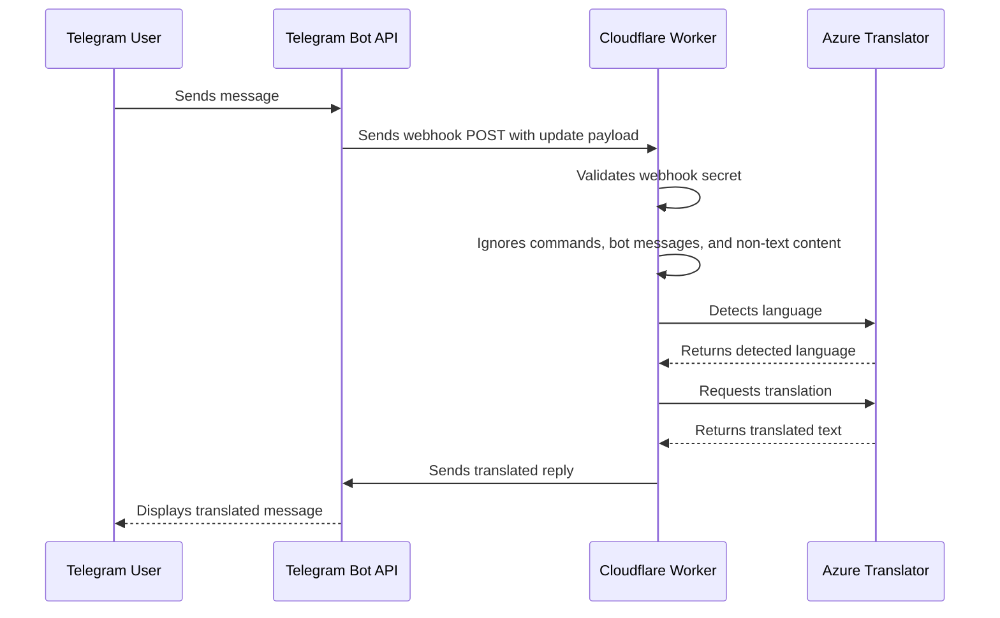

# Architecture

Cakap uses a simple webhook architecture.

## Components

| Component | Responsibility |
|---|---|
| Telegram Bot | Receives messages and sends translated replies |
| Telegram Webhook | Sends updates to the Cloudflare Worker endpoint |
| Cloudflare Worker | Executes bot logic and calls Azure Translator |
| Azure AI Translator | Detects language and translates text |
| Cloudflare Secrets | Stores API keys and tokens outside the source code |

## Request Flow

## Language Routing

| Detected language | Target language | Bot label |
|---|---|---|
| `en` | `id` | `🇮🇩 Indonesian` |
| `id` | `en` | `🇬🇧 English` |
| Other | Ignored | No reply |

## Design Choices

### 1. Webhook instead of polling

The bot uses a webhook model so Telegram can send updates directly to the Worker. This avoids running a server process or scheduled polling job.

### 2. Cloudflare Worker instead of a virtual machine

The Worker is sufficient because the bot logic is stateless:

- Receive webhook payload
- Validate secret
- Detect language
- Translate text
- Send reply

No database, queue, or VM is required for the basic version.

### 3. No message storage

The current implementation does not store message text. This keeps the implementation simple and reduces privacy risk.

### 4. Ignore commands

Commands such as `/start` are ignored so the bot does not translate bot-control messages.

### 5. Ignore bot messages

The Worker ignores messages from bots to reduce the risk of bot loops.

## Runtime Secrets

| Secret | Used by | Purpose |
|---|---|---|
| `TELEGRAM_BOT_TOKEN` | Telegram API calls | Sends translated replies |
| `WEBHOOK_SECRET` | Worker request validation | Confirms requests came through the configured Telegram webhook |
| `AZURE_TRANSLATOR_KEY` | Azure Translator API calls | Authenticates translation requests |
| `AZURE_TRANSLATOR_REGION` | Azure Translator API calls | Identifies the Azure Translator region |

## Failure Points

| Failure | Likely cause | Check |
|---|---|---|
| Worker URL does not load | Worker not deployed | Open Worker URL in browser |
| Webhook cannot be set | Wrong bot token or Worker URL | Check `setWebhook` URL format |
| Bot replies in private chat but not group | Privacy mode still enabled | Use BotFather `/setprivacy` and disable privacy |
| Translation fails | Azure key, region, or quota issue | Check Worker logs and Azure resource |
| Telegram send fails | Bot token or chat permission issue | Check token and whether bot is in group |

## Future Architecture Enhancements

- Add chat allowlisting so only approved groups can use the bot.
- Add lightweight telemetry without storing message content.
- Add simple admin commands for health checks.
- Add support for more languages through configuration.
- Add GitHub-to-Cloudflare deployment pipeline.
