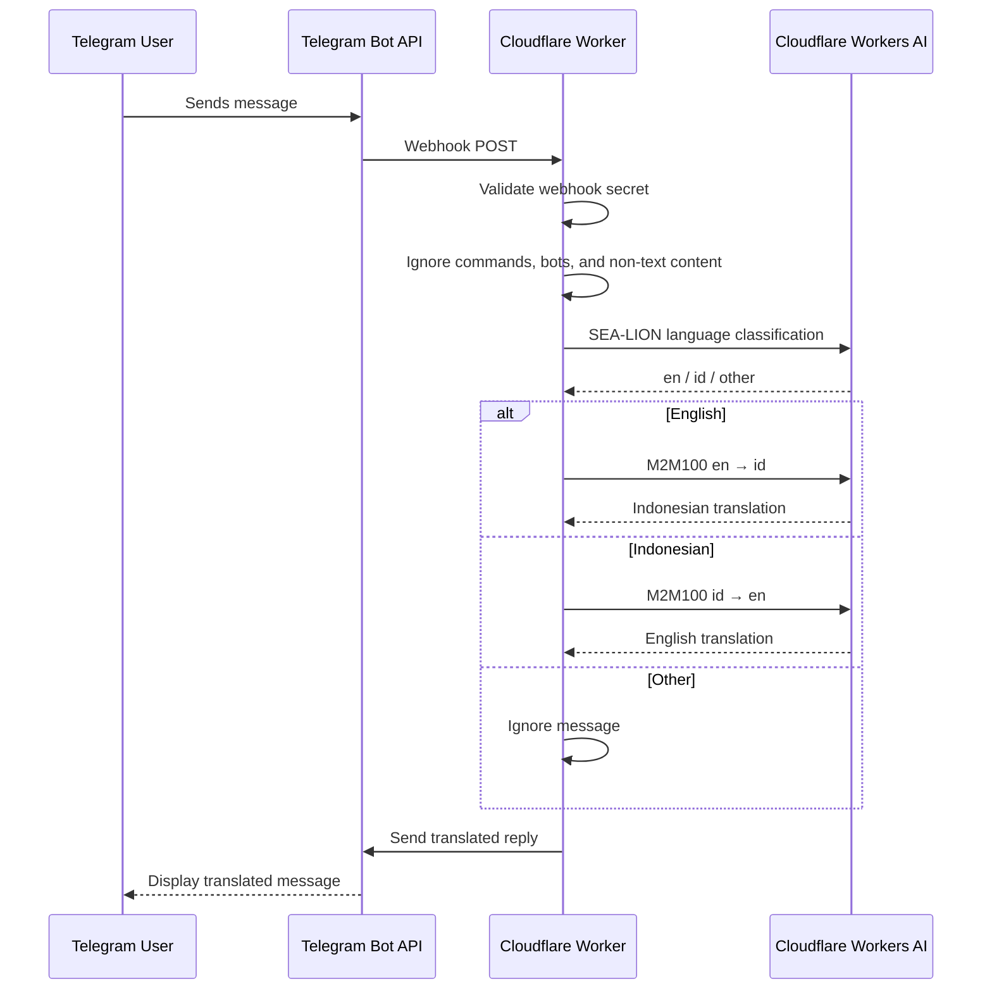

# Architecture

Cakap uses a stateless webhook architecture built entirely around Telegram and Cloudflare.

## Components

| Component | Responsibility |
|---|---|
| Telegram Bot | Receives messages and sends translated replies |
| Telegram Webhook | Sends updates to the Cloudflare Worker endpoint |
| Cloudflare Worker | Validates requests and executes bot logic |
| Workers AI — SEA-LION | Classifies source text as English, Indonesian, or other |
| Workers AI — M2M100 | Translates English ↔ Indonesian |
| Cloudflare Secrets | Stores Telegram credentials outside source code |
| Workers AI binding | Gives the Worker native access to Cloudflare-hosted AI through `env.AI` |

## Request Flow

```mermaid
sequenceDiagram
    participant U as Telegram User
    participant T as Telegram Bot API
    participant W as Cloudflare Worker
    participant AI as Cloudflare Workers AI

    U->>T: Sends message
    T->>W: Webhook POST
    W->>W: Validate webhook secret
    W->>W: Ignore commands, bots, and non-text content
    W->>AI: SEA-LION language classification
    AI-->>W: en / id / other
    alt English
        W->>AI: M2M100 en → id
        AI-->>W: Indonesian translation
    else Indonesian
        W->>AI: M2M100 id → en
        AI-->>W: English translation
    else Other
        W->>W: Ignore message
    end
    W->>T: Send translated reply
    T-->>U: Display translated message
```

## Language Routing

| Detected language | Target language | Bot label |
|---|---|---|
| `en` | `id` | `🇮🇩 Indonesian` |
| `id` | `en` | `🇬🇧 English` |
| `other` | None | No reply |

## Design Choices

### Webhook instead of polling

Telegram sends updates directly to the Worker. No always-on server or polling process is required.

### Cloudflare Worker instead of a VM

The bot is stateless and only needs to receive a webhook, validate it, classify and translate text, and send a reply.

### Native Workers AI instead of an external translation subscription

The original version called Azure AI Translator. The current version uses Cloudflare's native AI binding so translation no longer depends on a separate Azure subscription, API key, or region.

### Dedicated translation model

SEA-LION is used only to decide whether the source is English, Indonesian, or another language. Actual translation is delegated to Meta M2M100, a purpose-built multilingual translation model.

### No persistent message storage

The implementation does not write Telegram message text to a database.

### Ignore commands and bot messages

Commands such as `/start` and messages originating from bots are ignored to reduce noise and prevent loops.

## Runtime Configuration

| Item | Type | Purpose |
|---|---|---|
| `TELEGRAM_BOT_TOKEN` | Secret | Sends Telegram replies |
| `WEBHOOK_SECRET` | Secret | Validates Telegram webhook requests |
| `AI` | Workers AI binding | Makes Workers AI available as `env.AI` |

No Azure or third-party translation API credential is required.

## Failure Points

| Failure | Likely cause | Check |
|---|---|---|
| Worker URL does not load | Worker not deployed | Open Worker URL |
| Worker reports missing AI binding | `AI` binding not configured | Add Workers AI binding named `AI` |
| Webhook cannot be set | Wrong bot token or Worker URL | Check Telegram webhook configuration |
| Bot works privately but not in group | Bot privacy mode enabled | Disable privacy mode in BotFather |
| Language misclassified | Very short, mixed, or ambiguous text | Check Worker logs and test longer text |
| AI inference fails | Workers AI quota/model/capacity issue | Check Cloudflare Workers AI usage and status |
| Telegram send fails | Token or chat permission issue | Check bot token and group membership |

## Availability Consideration

This design removes the fixed Azure subscription dependency, but it still relies on Cloudflare keeping the selected models available. Model identifiers should therefore be treated as replaceable implementation details. If a model is deprecated, update `src/worker.js` and re-test both translation directions.

## Future Enhancements

- Add chat allowlisting.
- Add privacy-preserving usage counters.
- Add an admin health command.
- Add fallback models for AI model deprecation or temporary capacity errors.
- Add GitHub-to-Cloudflare deployment automation.
